# Тестування працездатності системи
Для тестування системи використовувся додаток Postman
## Запуск сервера
 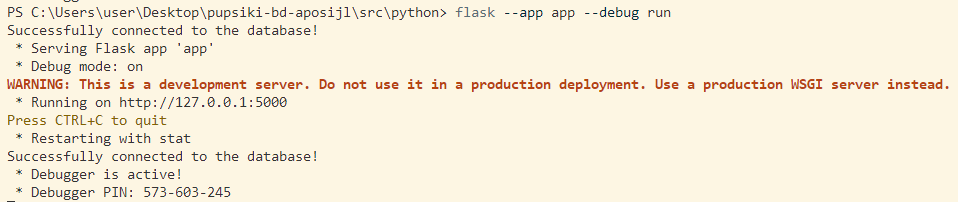

## Метод GET

### GET ALL PROJECTS
#### Запит
 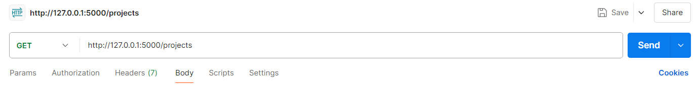
#### Відповідь
 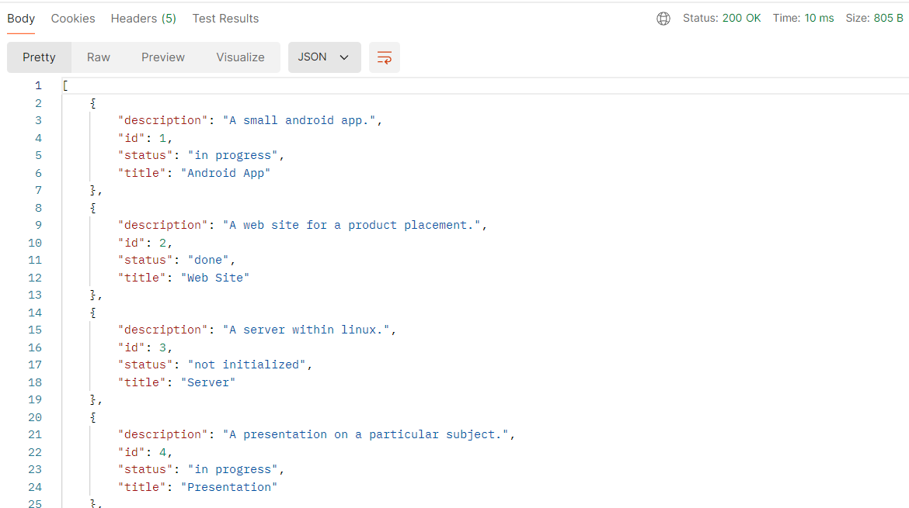

### GET PROJECTS BY ID
#### Запит
 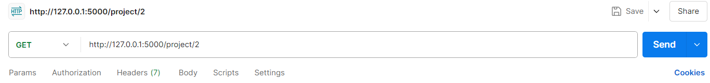
#### Відповідь
 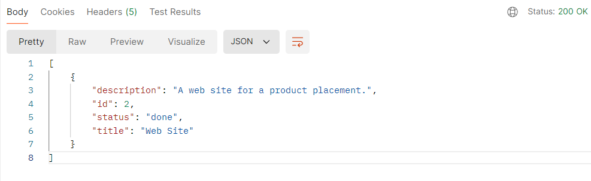

## Метод POST

### POST PROJECT
#### Запит
 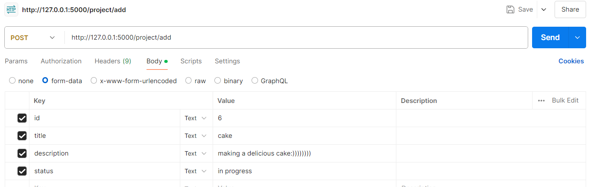
#### Відповідь
 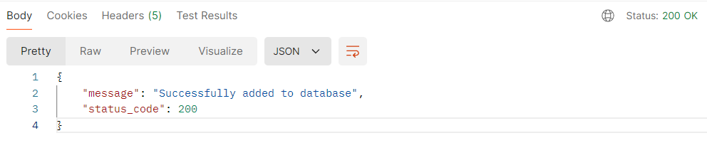

#### Перевірка за допомогою GET
 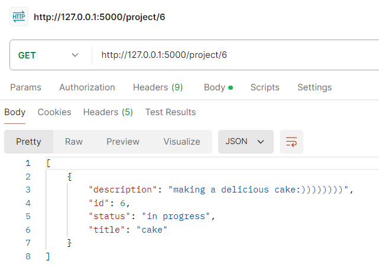

## Метод PATCH

### PATCH PROJECT
#### Запит
 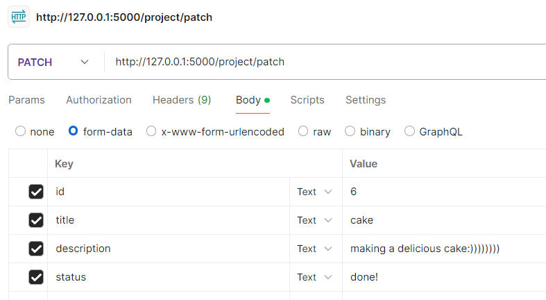
#### Відповідь
 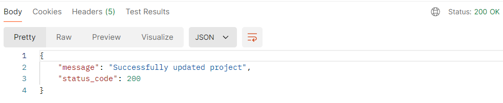

#### Перевірка за допомогою GET
 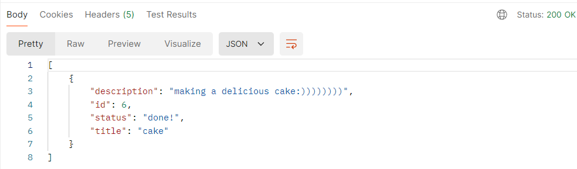
 
 ## Метод DELETE

### PDELETE PROJECT
#### Запит
 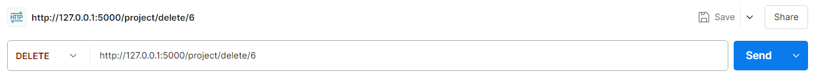
#### Відповідь
 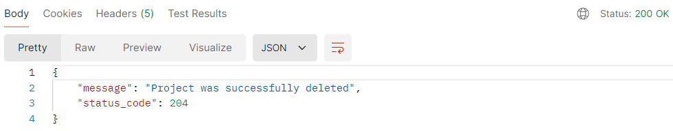

#### Перевірка за допомогою GET
 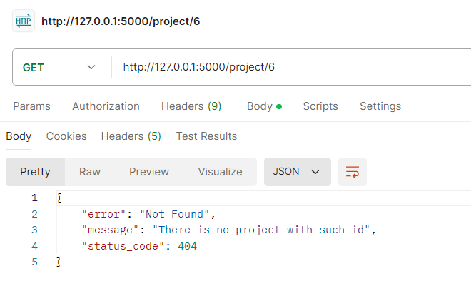
 
 
